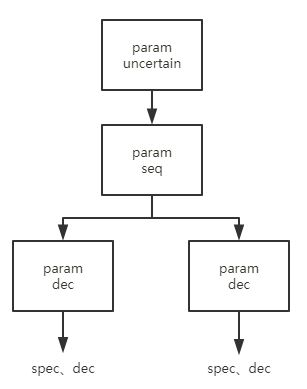

# <div align="center">编译系统设计实验</div>

### <div align="right">3150102103 肖  潼</div>

### <div align="right">3150104532 周佳瑜</div>

### <div align="right">3150104790 李天幼</div>

# 设计目的

设计并实现一个类C语言的编译系统，掌握编译原理的各个环节：词法分析、语法分析、语义分析、代码生成，以及实现所需的数据结构：语法书、符号表等。

# 系统目标

类C语言编译系统将会实现以下功能：

* 根据C语言标准文件 `Anti.C.Standard.pdf`，基本实现C语言所有的词法分析

* 根据C语言标准文件 `Anti.C.Standard.pdf`，基本实现C语言所有的语法分析

* 实现部分C语言的语义分析，生成中间树结构

* 分析生成的中间树，根据MIPS标准文件 `MIPS_Vol2.pdf`，生成MIPS汇编代码

# 过程分析

我们将整个类C语言编译系统分为以下几个步骤：

* lex词法分析

* yacc语法分析、生成抽象语法树

* 语义分析、生成符号表、生成栈帧、生成中间树

* 中间树规范化

* 指令选择

* 活跃性分析以及寄存器分配

下面我们将根据整个编译系统的设计顺序，介绍系统中每个模块的实现以及功能。

# lex词法分析

我们设计的类C语言词法分析严格按照C语言标准，参照了C语言标准文档 `Anti.C.Standard.pdf`。

根据标准文档的分类，C语言词法主要分为以下几类：

1. keyword
    
    关键字共有37个，包含了常用的关键字比如 *auto*，*const* 等，以及不常用的关键字比如 *volatile*，*_Complex* 等

2. identifier

    标识符是由字母或下划线开头，包含字母，下划线或数字的任意长度的字符串，它的正则表达式为： `[a-zA-Z_][a-zA-Z0-9_]*`

3. constant

    常量类包含了6种常量：

    * 十进制整数，可以有后缀u、U、l、L、ll、LL
    * 八进制整数，可以有后缀u、U、l、L、ll、LL
    * 十六进制整数，可以有后缀u、U、l、L、ll、LL
    * 十进制浮点数，可以为一般的浮点写法或者科学计数法写法，可以有后缀f、l、F、L
    * 十六进制浮点数，可以为一般的浮点写法或者科学计数法写法，可以有后缀f、l、F、L
    * 字符常量，字符常量为单引号引起的一串字符，可以为L'c-char-sequence'的形式，中间可以包含转义字符。

4. string-literal

    为了设计方便，字符串与其他常量划分为不同类，他是以 `L` 开头，被双引号包围的字符串，其中开头的 `L` 可以省略。
    
    它的正则表达式为：`L?\"([^\"\\\n]|(\\[\'\"\?\\abfnrtv]))*\"`

5. punctuator

    符号类包含了所有的运算或标识符，包含了例如运算符 `+`、`%`，或逻辑运算符 `&&`，`!`等

6. annotate

    注释类本来在预处理的过程中进行处理，由于我们没有设计预处理器，所以我们用lex简单地处理了程序中的注释。我们可以匹配`//`开头的单行注释，或者`/*`开头`*/`结尾的多行注释。多行注释从第一个`/*`开始到第一次出现`*/`结束，也就是多行注释不能进行嵌套。 

7. others

    其他符号类包含了一些没有运算层面含义的符号，比如 `\n`，`\\`等用于换行或标识的符号，其中用于匹配非法字符的 `.`，即 *default*，也定义在该类中

在词法分析这一步，我们使用的工具是更为现代的 *flex* 工具。

# 语法分析

抽象语法树是具体语法树经过逻辑抽象以后得到的接近代码本身的表达，方便了后续语义分析和中间树转化的进行。一方面要考虑到适合与用yacc的语法调用节点的构造函数进行构建，另一方面要尽量简化树的结构，使得语法树能够完整表示源程序中的语法信息，不删减语义信息，同时结构简单，便于语义分析。

在语法分析这一步，我们的类C语言编译系统能够解析出所有C语言标准中的语法，我们严格按照C语言标准文档 `Anti.C.Standard.pdf`进行设计，但舍去了部分不常见的类型比如 *_Bool*。

整个语法分析过程中使用了80余个 *token*， 一共能够解析69个语法，每个语法有多种解析格式，整个yacc语法分析文件有440余行，能够解析C语言中所有语法，判断程序语法的正确性。语法分析对应的代码是 *parser.y* ，我们使用的工具是更为现代的 *bison* 工具。

在C语言标准文档中，语法部分的具体定义在附录A中，所有语法被分为了4个子部分，分别为：

## 1 Expression

C语言中定义的Expression包括18个子Expression，经分析后，发现大致可以分为4类表达式：

1. 基本表达式，比如变量标识符、常量、字符串、括号括起来的Expression
2. 单目表达式，比如数组的某个元素、结构体的某个成员、自加、自减
3. 常见表达式，比如加减乘除、位运算、逻辑运算、三目运算、赋值运算
4. 逗号分隔的表达式列表

为了避免出现语法的歧义，C语言对不同优先级的运算都单独设计了一个Expression，并使用左递归和右递归处理运算符的结合性，比如：

```
multiplicative-expression:
    cast-expression
    multiplicative-expression * cast-expression
    multiplicative-expression / cast-expression
    multiplicative-expression % cast-expression

additive-expression:
    multiplicative-expression
    additive-expression + multiplicative-expression
    additive-expression - multiplicative-expression
```

通过这种方式区分了乘除法和加减法的优先级，依次类推，可以区分所有运算符的优先级。同时使用了左递归来表达加减乘除左结合的运算方式。

## 2 Declaration

Declaration是C语言语法中内容最多，设计最复杂，层次最不清晰的语法部分。我们分析后发现主要分为4大类，每一类中又有自己更加细致的语法。

### 2.1 declaration

declaration是Declaration中最重要的部分，包括各种类型、变量的声明或者定义。比如变量定义```int a,b = 2;```，数组定义```int a[5][5];```，指针定义```int *const a;```，函数声明```int f(int a)```， 结构体的定义```struct A{int a}b;```等，覆盖了所有的定义和声明。

declaration在C语言标准文档中的语法定义如下：
```
declaration:
    declaration-specifiers init-declarator-list;
    declaration-specifiers init-declarator-list;
```

declaration分为specifiers与declarator两部分，前者包括基本类型的声明定义，各种存储修饰，和结构体的定义声明。后者包括变量初始化，指针，函数形参，数组。

### 2.2 specifiers

specifiers可以进一步划分，包括storage-class-specifier（比如typedef、extern），type-specifier（比如void、char以及结构体、枚举类型的定义），type-qualifier（比如const），function-specifier（比如inline）等。

不同类型的specifier之间可以按任意顺序组合起来得到一列specifiers，但必须至少有一个。

type-specifier可以进一步细分，可以分为基本类型（比如void），结构体类型（比如struct和union），枚举类型，类型的别名（比如typedef语句定义的类型）。

对于结构体类型的定义，C语言标准文档中的相关语法定义如下：
```
struct-or-union-specifier:
    struct-or-union identifier { struct-declaration-list }
    struct-or-union { struct-declaration-list }
    struct-or-union identifier
```
其中struct-or-union可以为*struct*或者*union*，struct-declaration-list为一串struct-declaration。struct-declaration与declaration类似，但是其specifier可取的范围更小，并且struct-declator可以使用位域类型，具体的语法定义如下：

```
struct-declaration-list:
    struct-declaration
    struct-declaration-list struct-declaration

struct-declaration:
    specifier-qualifier-list struct-declarator-list ;

specifier-qualifier-list:
    type-specifier specifier-qualifier-list
    type-qualifier specifier-qualifier-list
    type-specifier
    type-qualifier

struct-declarator-list:
    struct-declarator
    struct-declarator-list , struct-declarator

struct-declarator:
    declarator
    declarator : constant-expression
    : constant-expression
```

枚举类型的语法定义在此处就不详细展开了。
    
### 2.3 declarator

declarator可以是一串变量名，或者一串带有数组，指针，函数的变量名，比如```*a, b[50], **c```，并且可以包含初始化。

declarator中包括了指针，数组，函数形参表。在标准文档中的语法定义如下：
```
declarator:
    pointer direct-declarator
    direct-declarator

direct-declarator:
    identifier
    ( declarator )
    direct-declarator [ assignment-expression ]
    direct-declarator [ ]
    direct-declarator [ * ]
    direct-declarator ( parameter-type-list )
    direct-declarator ( identifier-list )
    direct-declarator ( )
```

指针部分每一级指针都允许使用type-qualifier进行修饰,具体的语法定义如下：
```
pointer:
    * type-qualifier-list
    * type-qualifier-list pointer
    * pointer
    *
```

函数形参部分可以包括不定形参```...```可以传入不定个数的参数。其余的形参声明param-declaration都由两部分组成，包括declaration-specifiers和declarator两部分组成，也可以是declaration-specifiers和abstract-declarator两部分组成，语法与declaration相似。具体语法定义如下：
```
parameter-type-list:
    parameter-list
    parameter-list , ...

parameter-list:
    parameter-declaration
    parameter-list , parameter-declaration

parameter-declaration:
    declaration-specifiers declarator
    declaration-specifiers abstract-declarator
    declaration-specifiers
```

其中abstract-declarator与declarator略有区别，abstract-declarator没有变量名，而declarator必须有变量名,具体的语法定义如下：
```
abstract-declarator:
    pointer
    pointer direct-abstract-declarator
    direct-abstract-declarator

direct-abstract-declarator:
    ( abstract-declarator )
    direct-abstract-declarator [ assignment-expression ]
    direct-abstract-declarator [ * ]
    direct-abstract-declarator ( parameter-type-list )
    direct-abstract-declarator [ ]
    direct-abstract-declarator ( )
    [ assignment-expression ]
    ( parameter-type-list )
    [ ]
    ( )
```
    
### 2.4 initializer
    
initializer用于在变量定义的时候进行初始化，包括对简单变量的初始化，数组的初始化，结构体的初始化。initializer由designator与表达式两部分组成。designator用于在数组或者结构体中指定需要初始化的元素，具体的语法定义如下：
```
initializer:
    assignment-expression
    { initializer-list }
    { initializer-list , }

initializer-list:
    designation initializer
    initializer-list , designation initializer
    initializer
    initializer-list , initializer

designation:
    designator-list =

designator-list:
    designator
    designator-list designator

designator:
    [ constant-expression ]
    . identifier
```

## 3 Statements

Statements包括了各种流程控制语句，比如条件语句，循环，跳转，返回、包括了compound-statement（用大括号括起来的语句）也包括了Expression。组成了函数体，具体的语法定义如下：
```
statement:
    labeled-statement
    compound-statement
    expression-statement
    selection-statement
    iteration-statement
    jump-statement

labeled-statement:
    identifier : statement
    case constant-expression : statement
    default : statement

compound-statement:
    { block-item-listopt }

block-item-list:
    block-item
    block-item-list block-item

block-item:
    declaration
    statement

expression-statement:
    expression ;
    ;

selection-statement:
    if ( expression ) statement
    if ( expression ) statement else statement
    switch ( expression ) statement

iteration-statement:
    while ( expression ) statement
    do statement while ( expression ) ;
    for ( expressionopt ; expressionopt ; expressionopt ) statement
    for ( declaration ; expressionopt ; expressionopt ) statement

jump-statement:
    goto identifier ;
    continue ;
    break ;
    return expression ;
    return ;
```

## 4 Externel definitions

其中的translation-unit是语法树的根节点，externel definition包括了最外层的各个定义、声明以及函数的定义。具体的语法如下：
```
translation-unit:
    external-declaration
    translation-unit external-declaration

external-declaration:
    function-definition
    declaration

function-definition:
    declaration-specifiers declarator declaration-list compound-statement
    declaration-specifiers declarator compound-statement

declaration-list:
    declaration
    declaration-list declaration
```

## 5 遇到的问题和解决

我们在编写parser.y的过程中，发现根据C语言的标准文档，有些语法无法通过bison进行解析，会出现reduce-reduce冲突。经过调试，我们发现reduce-reduce冲突是由于type-specifier中可以使用之前typedef过的类型名，涉及到的语法如下：

```
type-specifier:
    void
    char
    ...
    struct-or-union-specifier
    enum-specifier
    typedef-name

typedef-name:
    identifier
```

产生错误的原因是typedef-name可以由identifier构成，然而identifier也可以作为expression的一部分，并且还有其他多个地方identifier充当了不同的角色。当bison扫描到identifier的时候不知道该将其作为类型还是表达式进行解析。

我们在网上查找了修改的方法，发现唯一的方法是在做语法分析的时候访问语义分析阶段维护的符号表来判断identifier是类型还是表达式。这一解决方法破坏了编译器的层次结构，于是我们修改了语法，我们将typedef-name的语法修改为了：
```
typedfe-name:
    $ identifier
```
从而避免了reduce-reduce冲突。

C语言标准文档中的语法定义并没有对所有的C语言语法进行限制，比较宽松，还有一些C语言语法需要语义分析进一步约束。比如按照C语言语法```long long long a```是允许的，但是C语言的语义规定了long最多只能出现两次。又比如按照C语言语法在函数体内```int a[*]```是允许的，但是C语言的语义规定了这种写法只能写在函数形参表中。

# 抽象语法树

我们在语法分析的过程中生成抽象语法树。这一部分对应的代码是 *absync* 和 *symbol* ，这部分的主要功能是在解析C语言语法的同时，利用yacc的语法，自底向上的构建抽象语法树。*absync.h*文件中定义了所有抽象语法树的节点，并有各个节点构造函数的函数原型。*absync.c*文件中定义了抽象语法树各个节点构造函数。

经过对C语言语法的抽象之后，我们参考tiger的方式构造了12类节点，每个节点中保存了*token*所在位置、节点类型kind以及一个union结构，包含一到多个指针，指向组成这个节点的子节点。各类节点的详细介绍如下：

## 1 Exp

Exp由C语言中Expression类的所有语法抽象而来，包括Expression部分的所有具体语法。具体而言，Exp又可以分为22种子类型，包括常量（int，float，char，string），标识符，数组变量，函数调用，点运算，指针运算，单目运算（后缀加，前缀加，后缀减，前缀减，sizeof）,类型转换，双目运算，三目运算，赋值语句，初始化等。

## 2 Spec

Spec对应着C语言语法中的declaration-speicifiers等specifier和qualifier。具体包括变量定义时的基本类型以及修饰符部分，以及结构体，枚举类型的定义，但不包括指针部分以及变量名、数组、函数等部分。比如```int```, ```struct{int a;}```, ```const```, ```extern```等。

Spec具体可以分为5个子类，分别为storage，type，qual_type，func_type和seq。其中storage，qual_type，func_type类型union中存放的都是枚举类型，因为这些类型对应的语法只有一些关键字，具体定义如下：
```c
typedef enum{
    A_TYPEDEF, A_EXTERN, A_STATIC, A_AUTO, A_REGISTER
}A_storage_type;

typedef enum{
    A_CONST, A_RESTRICT, A_VOLATILE
}A_qual_type;

typedef enum{
    A_INLINE
}A_func_type;
```
seq类型的Spec以树的结构管理一串Spec，对应的union中定义如下：
```c
struct{
    A_spec spec;
    A_spec next;
}seq;
```

type类型的Spec最为复杂，其中包括了基础类型、结构体类型、枚举类型等复杂类型，于是我们将type类型的Spec进一步抽象为一类节点，具体介绍在下一节。

## 3 Type

Type类型对应着C语言语法中的type-specifier，是组成Spec的一个子节点，包括基本类型（比如void，char，int）、定义的类型名（由typedef语句定义）和一系列复杂类型（结构类型，联合类型，枚举类型）。

Type类型可以细分为4种子类，包括simple，struct_union，enumtype，typeid。

simple类型的Type表达基本类型，这些基本类型仅包括一些关键字，具体定义如下：
```c
typedef enum{
    A_VOID, A_CHAR, A_SHORT, A_INT, A_LONG, A_FLOAT,
    A_DOUBLE, A_SIGNED, A_UNSIGNED,
    A_STRUCT, A_UNION, A_ENUM
}A_prim_type;
```

typeid类型为typedef定义的类型名，对应语法中跟随在```$```符号后面的类型名，用S_symbol表示。

struct_union类型包括了struct和union两种类型，包括结构类型的名字，以及成员变量列表。成员变量列表用一个declaration节点表示。具体定义如下：
``` c
struct{
    A_prim_type struct_union;
    S_symbol id;
    A_declaration dec_list;
}struct_union;
```

enumtype类型包括了枚举类型的名字以及一个init节点。具体定义如下：
``` c
struct{
    S_symbol id;
    A_init init_list;
}enumtype;
```

## 4 Pointer
    
对应着C语言语法中的pointer，包括指针定义时的 * 以及const等修饰符，是dec的组成部分。具体结构定义如下：
``` c
struct A_pointer_
{
    A_pos pos;
    enum{
        A_simple_pointer,
        A_seq_pointer
    }kind;
    union{
        A_spec simple;//qual_list
        struct{
            A_pointer pointer;
            A_pointer next;
        }seq;
    }u;
};
```

对于```**const *a```将被转换为以下样子的语法树：


## 5 Param

Param对应C语言语法中函数声明时的参数列表，是函数类型声明（dec)时的一个组成部分。Param具体可以分为3种，分别为uncertain，seq和dec。

uncertain类型对应着不定参数```...```可以传递多个参数。

seq类型为树状结构组织的形参列表。

dec类型为一般的形参，包括一个Spec和一个Dec，与一般的变量声明的结构一致。

具体代码如下：
``` c
struct A_param_
{
    A_pos pos;
    enum{
        A_uncertain_param,
        A_seq_param,
        A_dec_param
    }kind;
    union{
        A_param uncertain;
        struct{
            A_param param;
            A_param next;
        }seq;
        struct{
            A_spec spec;
            A_dec  dec;
        }dec;
    }u;
};
```

对于```int a, int b, ...```将被转换为以下样子的语法树：



## 6 Dec

对应C语言语法中的declator和abstract-declator对于abstract-declator来说，部分指向子节点的指针会出现NULL的情况（因为没有变量名）。dec对应变量定义时后半部分，包括变量名，函数名，函数参数列表，数组，指针等。之前提到的Pointer是Dec的组成部分。

dec可以具体分为9个类型。分别为simple，seq，init，bit，pointer，array，array_proto，func，funcid。

simple类型的dec只有变量名。

seq类型的dec为树状结构组织的一列Dec。

init类型的dec包括dec和用于初始化的init。
```c
struct{
    A_dec dec;
    A_init init;
}init;
```

bit类型为结构体中的位域，包括dec和表示位长度的const_exp。
```c
struct{
    A_dec dec;
    A_exp const_exp;
}bit;
```

pointer类型为指针的dec，包括一个dec（为变量名，或者数组，函数等，对应着数组指针，函数指针）和一个pointer类型。
```c
struct{
    A_pointer pointer;
    A_dec dec;
}pointer;
```

array类型为数组的dec，包括一个dec（为变量名或者数组，指针，函数等，对应着高维数组，指针数组，函数数组）和一个assign_exp指定了数组大小（在函数声明中这个可能为NULL)。
```c
struct{
    A_dec dec;
    A_exp assign_exp;
}array;
```
对于`a[][10]`将被转换为下面样子的抽象语法树：


array_proto类型专门表达类似于`a[*]`的结构，仅出现在函数声明中。单独列一个类型是为了之后的语义分析能够分辨`a[*]`与`a[]`。

func类型为函数的dec，包括一个dec（为函数名或其他）以及一个param。
```c
struct{
    A_dec dec;
    A_param param_list;
}func;
```

## 7 Declaration

对应C语言语法中的declaration，表示一个完整的声明，通常包括spec和dec两部分，一定包括变量名。在语义分析中需要根据spec和dec综合得到变量的类型。

declaration可分为两个子类型，分别为simple和seq。具体代码如下：
```c
struct A_declaration_
{
    A_pos pos;
    enum{
        A_simple_declaration,
        A_seq_declaration
    }kind;
    union{
        struct{
            A_spec spec;
            A_dec  dec;
        }simple;
        struct{
            A_declaration declaration;
            A_declaration next;
        }seq;
    }u;
};
```

## 8 Type_name

对应C语言语法中的type_name，表示类型转换时括号中填入的类型。包括一个spec和一个dec（abstract-declarator），与declaration略有不同，一定不包括变量名。

## 9 Designator

对应C语言语法中的designator，用于初始化时指定结构体或数组的成员。比如 `.name`, `[0]`。是init的子节点。

## 10 Init

对应C语言语法中的init，表示初始化时的初始值，既可以是简单的常量表达式，也可以是给数组，结构体初始化的复杂表达式。

init可以分为4种子类型，分别为simple，seq，enumtype和designation。

simple类型的init包含一个表达式，表达式的值就是变量的初始值。

enumtype类型的init用于枚举类型的初始化，对应着枚举类型定义时类似`a=1`的语法，包括一个变量名和一个常量表达式。

designation类型的init用于对结构体的初始化，包括一个designator和一个init。

## 11 Stat

对应C语言语法中的statement，表示具体的语句。包括以分号结尾的expression，以及for，while，if，goto等流程控制语句。

stat可以分为17种子类型，包括block（方括号引起的内容，为了在语义分析时维护scope），exp，dec（类型声明），seq，label，casestat，defaultstat，ifstat，switchstat，whilestat，dowhile，forexp，fordec（在for语句中定义变量），gotostat，continuestat，breakstat，returnstat。

## 12 Def

对应C语言语法中的definition，是整个抽象语法树的树根，包括文件中的函数定义和变量定义。

Def具体可以分为3个子类型，分别为simple，seq，func。

simple类型的def包括一个declaration，表示一个变量声明。

func类型的def包括spec，dec，declaration，stat。其中spec，dec包含了函数的签名，declaration对应着函数形参的声明，stat对应着函数体，具体的定义如下：
```c
struct{
    A_spec spec;
    A_dec func;
    A_declaration args;
    A_stat stat;
}func;
```

## 实现细节

我们参考了tiger的实现，对于每一个节点，使用一个构造函数进行构造，并与yacc语法结合使用，在语法分析的过程中自底向上构造抽象语法树。由于这部分代码逻辑上的重复度很高，我们使用了C语言中的宏，大大地减少了代码量。

比如为了构造exp类型中的id子类型节点，该节点定义如下：
```c
struct A_exp_
{
    A_pos pos;
    enum{
        //...
    }kind;
    union{
        S_symbol id;
        //...
    }u;
}
```

我们设计了这样的宏：
```c
#define A_0(type, name) \
A_##type _A_##name##_##type (A_pos pos)\
{\
    A_##type p = checked_malloc(sizeof(*p));\
    p->kind = A_##name##_##type;\
    p->pos = pos;\
    return p;\
}
```
并将构造函数的定义简化为了：
```c
A_1(exp, id, S_symbol);
```

针对不同数目参数的构造函数，我们又设计了A_1，A_2，A_3，A_4等宏简化函数定义，type节点的4类子节点的构造函数简化后如下：
```c
A_1(type, simple, A_prim_type);
A_1(type, typeid, S_symbol);
A_3(type, struct_union, A_prim_type, struct_union, S_symbol, id, A_declaration, dec_list);
A_2(type, enumtype, S_symbol, id, A_init, init_list);
```

我们在yacc分析语法的同时，调用构造函数构造抽象语法树，以primary_expression的语法分析为例，我们在yacc中的代码如下：
```yacc
primary_expression:
      IDENTIFIER            {$$ = _A_id_exp(charPos, _S_symbol($1));}
    | INT_DEC_CONST         {$$ = _A_intexp_exp(charPos, $1);}
    | INT_OCT_CONST         {$$ = _A_intexp_exp(charPos, $1);}
    | INT_HEX_CONST         {$$ = _A_intexp_exp(charPos, $1);}
    | FLT_DEC_CONST         {$$ = _A_floatexp_exp(charPos, $1);}
    | FLT_HEX_CONST         {$$ = _A_floatexp_exp(charPos, $1);}
    | CHAR_CONST            {$$ = _A_charexp_exp(charPos, $1);}
    | STR_LITERAL           {$$ = _A_strexp_exp(charPos, $1);}
    ;
```

## 抽象语法树测试

我们设计了testAST模块将抽象语法树打印出来，我们采用类似递归下降的方法，递归地打印各个节点。

整个模块代码生成一棵AST树，并且经由测试模块 *testAST* 可以将生成的树状结构输出，例如C语言代码如下：


该代码会被转为如下的AST树结构


# 语义分析

该部分的主要功能是，通过解析上一步生成的AST树，进行语义分析，判断是否有语法上的错误，例如如下代码：
```
++ 10;
```

该代码在语法分析和生成抽象语法树的部分都不会出现错误，因为 10 是一个unary_expression，而运算符 `++` 在yacc文件中的定义如下：
```
unary_expression:
    DOUBLE_PLUS unary_expression      {$$ = _A_prepp_exp(charPos, $2);}
```

这一步并不会导致语法错误，而在语义层面上，常量是右值，不能进行 `++` 运算，这需要在语义分析中进行分析。

语义分析部分我们参照tiger的语义分析，采用递归下降的方式进行了类型检查，符号表维护，生成中间树等。我们参考了C语言标准文档，并使用gcc测试了各种语法，以尽量和标准的语义一致。

最终我们实现了较完善的语义分析，我们可以分析结构体的定义，包括结构体的嵌套，链表结构。我们对指针和数组的分析也比较完善，我们的语义分析支持多级指针，常量指针和指针常量以及函数指针，并能通过函数指针调用函数。我们对数组支持数组作为参数进行传递，支持多维数组以及数组和指针之间的赋值。同时我们也支持typedef以及递归函数。

语义分析部分，需要完成的任务有类型的检查、栈帧空间的分配、生成中间树。为了完成这些任务，语义分析必须要维护符号表和各个变量的类型，由于语义分析阶段任务较多，所以相应的源代码和文件，数据结构也比较多。

大致上，我们将语义分析部分需要用到的数据结构和文件分为了以下几类：

1. 符号表
    
    包括table.c、symbol.c、env.c。其中定义了符号表的数据结构以及对符号表的各种操作，用于类型绑定和分配空间与变量的绑定。

2. 类型

    包括types.c文件，其中定义了各种类型的数据结构，并且定义了配套的类型检查，类型连接，类型大小计算等功能。

3. 栈帧

    包括translate.c、frame.c、temp.c文件。在frame.c文件中定义了mips架构中能使用的寄存器，以及栈帧的结构、变量分配和读取函数。在temp.c文件中定义了临时寄存器和标号，可以根据需要分配临时寄存器和标号，在后面的寄存器分配会将临时寄存器绑定到mips架构中的寄存器上。translate.c文件调用frame.c文件中的函数，为程序中的各个变量分配空间，并进行抽象，形成与底层架构无关的关于变量空间的表示。

4. 中间树

    包括translate.c、tree.c文件。在tree.c文件中定义了中间树的结构和中间树各个节点的构造函数，中间树的结构在下一章中会详细介绍。translate.c文件中定义了semant.c与tree.c文件之间的接口，将表达式转换为对应的中间树，中间进行了常量传播等优化，使得生成的中间树更简单。

5. 语义分析

    包括semant.c文件，其中定义了语义分析和检查的逻辑，综合调用其他各个模块实现最终的功能。采用递归下降的方式，对AST中的每一个节点都有对应的语义分析函数，从而实现类型检查，符号表维护，栈帧分配，中间树生成的任务。

我们将依次对各个部分进行详细介绍。

## 符号表

根据C语言标准，C语言在进行语义分析的时候3种link方式，4个namespace，4个scope。

### 1 linkage类型

3种Link方式分别为external，internal和nolink。

举例来说，函数外部定义的变量是external link的，函数外部以extern修饰的变量也是external link的，意义是整个程序中，不同源代码，相同external link的变量将指代同一个entity。

函数外部以static修饰的变量是internal的，意义是同一个源代码中，相同static link的变量将指代统一个entity。

函数内部的变量是nolink的，意义是每一个声明都指代不同的entity。

### 2 scope类型

4个scope分别为file，function，block，function prototype。

举例来说，直接定义在文件中的函数以及变量都是file scope的。

只有label具有function scope，不同function中定义的label互不干扰。

在方括号括起来的部分定义都是block scope的，比如函数体。

在函数声明中的部分是function prototype scope的。

### 3 namespace类型

4个namespace，分别为label，tag，member，others。

举例来说，label namespace仅包括标号，用于goto语句进行跳转。tag namespace表示的是结构体的名字，比如`struct A{int b}c;`其中A就属于tag namespace。每个结构体会有自己的member namespace，即成员变量命名空间，上例中的b就属于member namespace。others namespace中涵盖了一般变量的命名和函数的命名。


C语言标准中关于变量重复定义的有关约束要综合考虑link、scope和namespace类型，比如nolink类型的变量在同一个scope和namespace中不能重复定义。具体定义在C语言标准准6.2节。

我们为了能尽可能与标准一致地对变量重复定义进行判断，我们在tiger的基础上修改了符号表和环境。

我们修改了tiger中的命令式符号表。我们将符号表改为了链表连接的hash表，每个hash表代表一个scope，这样可以方便地判断当前scope中是否有重复定义，也可以在较短时间内在所有scope中找到一个变量名的定义。修改后的符号表结构如下图所示：


我们在tiger的基础上修改了环境，我们设立了两个环境，分别为linkenv和nameenv，linkenv用于维护linkage的类型，nameenv用于委会4个namespace。linkenv中包含3张表，分别为exlink，inlink，nolink，nameenv中包含4张表，分别为lenv，tenv，menv，venv。每张表的结构都为我们改进以后的符号表。具体定义如下：
```c
//namespaces
struct E_namespace_
{
    S_table lenv;//label     symbol->Temp_label
    S_table tenv;//tag       symbol->type
    S_table venv;//ordinary  symbol->E_enventry
    S_table menv;//member    symbol->E_enventry
};

struct E_linkage_
{
    S_table exlink;//symbol->Tr_access
    S_table inlink;//symbol->Tr_access
    S_table nolink;//symbol->Tr_access
};
```

对不同的表，我们会绑定不同的东西。对于namespace中的4张表来说，lenv仅需要维护标签的标号和是否已定义，tenv仅需要维护变量名对应的类型，menv需要维护变量名对应的类型，venv需要维护变量名对应的类型，以及分配的空间。对于linkenv中的3张表来说，最重要的是维护变量名对应的分配空间。我们基于这几点的分析，设计了E_enventry结构，使得这个结构可以通用与这些符号表的绑定，并能够表达这些信息。E_enventry结构如下：
```c
struct E_enventry_
{
    enum{
        E_varEntry,
        E_funcEntry,
        E_labelEntry
    }kind;
    union
    {
        struct{
            Tr_access access;
            Ty_ty ty;
        }var;
        struct{
            Tr_level level;
			Ty_ty functy;
        }func;
        struct{
            Temp_label label;
            int complete;
        }label;
    }u;
};
```

包括3种类型，分别为var，func和label。对于var来说需要知道类型和分配的空间，对于func来说需要知道类型和分配的栈帧，对于label来说需要知道名字和是否完整。

与符号表一同设计的还有beginScope和endScope，分别表示开始一个新的scope和结束一个scope。开始一个新的scope需要新建一张hash表并连接到已有的hash表上，结束一个scope只需要将当前指向的hash表改为parent。我们在编程中发现nameenv中的4张表经常一起新建scope，于是设计了特殊的E_BeginScope函数，函数定义如下：
```c
E_namespace E_BeginScope(S_scope scope, E_namespace space)
{
    if (scope == S_FUNC)
        space->lenv = S_beginScope(scope, space->lenv);
    space->tenv = S_beginScope(scope, space->tenv);
    space->venv = S_beginScope(scope, space->venv);
    if (scope == S_BLOCK)
        space->menv = S_beginScope(scope, space->menv);
    return space;
}
```

lenv只有在开启一个function scope时分配新的hash表，menv只有在开启一个block scope时分配新的hash表。

## 类型

为了能完全的表示C语言中的各种类型，一个类型结构需要包含类型的大小和对齐方式，类型的完整性，类型的修饰，类型的具体表示。我们从之前AST中得到启发，使用树状结构来表示各个类型。类型定义如下：
```c
struct Ty_ty_
{
    unsigned long specs;//only contains storage spec, qual, func type
    int align;
    struct Ty_expty size;//for variable length array
    int complete;//default to 0
    enum{
        ...
    }kind;
    union{
        ...
    }u;
};
```

Ty_ty中的specs中存储了类型的修饰，每个修饰比如const，extern用一个二进制位表示。align中存储了对齐的字节数，size中存储了类型的大小，size是一个有表达式有类型的结构体，这样设计可以支持变量下标的数组大小比如`int a[b];`，complete表示了类型是否是完整的，不完整的类型在定义时无法分配空间，会报错。

在Ty_ty中，一共定义了9种不同的类型，分别为forward，name，basic，struct，union，bit，pointer，array，func。

### 1 forwardTy

forwardTy 类型指向一个其他类型，该类型用于前向声明一个函数或者一个结构体，从而支持递归函数以及链表结构的分析。当遇到一个结构体或者函数的声明时，会先将一个incomplete的forwardTy添加到符号表中，当整个函数声明结束或者结构体声明结束以后，forwardTy将变成complete的。

### 2 nameTy

nameTy类型指向一个其他类型，该类型用于实现typedef，可以将一个变量绑定到nameTy再通过nameTy的指针找到真正代表的类型。这样的好处是可以将typedef的变量和一般变量绑定在同一张符号表中，而不用担心分不清这个变量代表的是type还是值。

### 3 basicTy

basicTy类型包括两种类型，一种为程序中的常量，比如`123`,`'c'`等直接写在程序中的常量，第二种为程序中定义的简单类型的变量或者常量，比如`int a`,`char a`。将这两种类型进行区分的目的是为了在数组定义的时候确定是长度确定的数组还是长度不确定的数组。这两种类型的区分体现在他们的结构上。basicTy类型由一个指针。如果是第一种程序中的常量，该指针会指向NULL，并且Ty_ty结构是预定义好的。如果是第二种类型，则该指针会指向一个预定义好的basicTy类型，并且可以添加const等类型修饰。如下图所示：


### 4 structTy、unionTy

structTy用于表达结构体类型，包括一个Ty_sFieldList结构体，该结构体维护一个链表，其中每个节点都是Ty_sField。Ty_sField结构的定义如下：
```c
struct Ty_sField_
{
    Ty_ty ty;
    S_symbol name;
    int offset;
    Ty_sField next;
};
```

其中维护了各个成员的类型，名字，在结构体中的偏移。

结构如下图所示：


### 5 bitTy

bitTy用于表达位域类型，包括位域的类型和位长。具体定义如下：
``` c
struct
{
    Ty_ty ty;
    int bitSize;
}bitTy;
```

### 6 pointerTy

pointerTy用于表达指针类型，指向它所指向的类型。可以通过specs为当前指针添加const等修饰。

### 7 arrayTy

arrayTy用于表达数组类型，包括数组类型，以及数组长度，用于sizeof函数。

### 8 funcTy

funcTy用于表达函数类型，包括返回值类型，以及函数形参表。形参表通过Ty_fieldList结构进行维护，每个field结构如下：
```c
struct Ty_field_
{
    Ty_ty ty;
    S_symbol name;
    Ty_field next;
};
```

我们不仅定义了类型的结构，我们也设计了函数来检查类型的修饰以及类型是否相同，是否能相互赋值等。最重要的两个函数为Ty_calcASC和Ty_linkTy。这两个函数用于在语义分析过程中，将分析得到的spec与type组装为一个完整的type，并计算这个type的完整性，大小，align。Ty_linkTy会将两个类型连接起来，主要用于指针，数组和函数与对应的类型连接，采用递归的方式。Ty_calcASC函数以递归的方式计算当前type是否完整，size和align等信息。

types.c中提供的对外接口如下：
```c
Ty_ty Ty_Null();
Ty_ty Ty_Void();    
Ty_ty Ty_Char();    Ty_ty Ty_VChar(unsigned long);
Ty_ty Ty_UChar();   Ty_ty Ty_VUChar(unsigned long);
Ty_ty Ty_Short();   Ty_ty Ty_VShort(unsigned long);
Ty_ty Ty_UShort();  Ty_ty Ty_VUShort(unsigned long);
Ty_ty Ty_Int();     Ty_ty Ty_VInt(unsigned long);
Ty_ty Ty_UInt();    Ty_ty Ty_VUInt(unsigned long);
Ty_ty Ty_Long();    Ty_ty Ty_VLong(unsigned long);
Ty_ty Ty_ULong();   Ty_ty Ty_VULong(unsigned long);
Ty_ty Ty_LLong();   Ty_ty Ty_VLLong(unsigned long);
Ty_ty Ty_ULLong();  Ty_ty Ty_VULLong(unsigned long);
Ty_ty Ty_Float();   Ty_ty Ty_VFloat(unsigned long);
Ty_ty Ty_Double();  Ty_ty Ty_VDouble(unsigned long);
Ty_ty Ty_LDouble(); Ty_ty Ty_VLDouble(unsigned long);
```

Ty_Void()等函数可以返回预定义类型的指针，Ty_VChar()函数能根据传入的类型修饰，返回一个经过修饰的基本类型，用于变量的定义。

```c
int Ty_isVoidTy(Ty_ty ty);
int Ty_isBasicCTy(Ty_ty ty);
int Ty_isIntTy(Ty_ty ty);
int Ty_isIntCTy(Ty_ty ty);
int Ty_isRealTy(Ty_ty ty);
int Ty_isArithTy(Ty_ty ty);
int Ty_isScalarTy(Ty_ty ty);
int Ty_isArrayTy(Ty_ty ty);
int Ty_isPointerTy(Ty_ty ty);
int Ty_isFuncTy(Ty_ty ty);
int Ty_isSUTy(Ty_ty ty);
int Ty_isMLTy(Ty_ty ty);//modifieable lval
int Ty_isCompleteTy(Ty_ty ty);
```

这些函数可以测试类型是否属于某一类，以及这个类型是否完整，是否是可以修改的左值。

```c
int Ty_areSameTy(Ty_ty ty1, Ty_ty ty2);
int Ty_canAssignTy(Ty_ty dst, Ty_ty src);
int Ty_canGetPointer(Ty_ty ty);
```
这些函数测试两个类型是否相同，是否可以赋值，是否可以取地址。

```c
Ty_ty Ty_muldivTy(Ty_ty ty1, Ty_ty ty2);
Ty_ty Ty_modTy(Ty_ty ty1, Ty_ty ty2);
Ty_ty Ty_plusminusTy(Ty_ty ty1, Ty_ty ty2);
Ty_ty Ty_lrshiftTy(Ty_ty ty1, Ty_ty ty2);
Ty_ty Ty_bitwiseTy(Ty_ty ty1, Ty_ty ty2);
Ty_ty Ty_logicTy(Ty_ty ty1, Ty_ty ty2);
```

这些函数可以根据运算和传入的两个类型得到返回值的类型，内部会做自动的类型转换。


## 栈帧

栈帧定义在frame.h中，涉及的结构主要有F_access，F_frame，F_frag。F_access表示了一个变量的存储。F_frame表示了一个栈帧的变量分配情况。F_frag表示了一个F_frame以及对应的函数体。具体的定义如下：
```c
struct F_access_
{
    enum{
        F_inFrame,
        F_inReg,
        F_inStr,
    }kind;
    union{
        struct{
            int offset;
            int size;
        }frame;
        Temp_temp reg;
        struct{
            int offset;
            int size;
            string str;
        }str;
    }u;
    F_access next;
};
```

F_access有3种类型，分别为inFrame，inReg和inStr，表示在栈中分配，在寄存器中分配，在全局数据区分配字符串。

```c
struct F_frame_
{
    F_accessList locals;
    Temp_label   name;
    Temp_label   end;
    int          size;
};
```
F_frame中存储了栈帧的名字，结束标号和当前分配的大小。

```c
struct F_frag_ {
    T_stm body;
    F_frame frame;
    F_frag next;
};
```

F_frag中存储了栈帧和对应的函数体。

栈帧在分配空间的时候按地址连续分配，在函数调用时，栈帧的结构如下图所示：


## 中间树

在translate.c中我们参考了tiger的语法，将表达式翻译成对应的中间代码或者调用栈帧提供的函数分配空间。

我们在翻译Binop的时候使用了常量传播的优化，使得生成的中间树更加简洁，以乘法操作的常量传播为例：
```c
if (unEx(exp2)->kind == T_CONST)
{
    int b = Tr_getIntConst(exp2);
    T_exp temp = unEx(exp1);
    if (temp->kind == T_CONST)
        return Tr_IntConst(Tr_getIntConst(exp1) * b);
    if (temp->kind == T_BINOP && temp->u.BINOP.op == T_mul)
    {
        if (temp->u.BINOP.left->kind == T_CONST)
            return Tr_Ex(T_Binop(T_mul, T_Const(temp->u.BINOP.left->u.CONST * b), temp->u.BINOP.right));
        if (temp->u.BINOP.right->kind == T_CONST)
            return Tr_Ex(T_Binop(T_mul, temp->u.BINOP.left, T_Const(temp->u.BINOP.right->u.CONST * b)));
    }
}
return Tr_Ex(T_Binop(T_mul, unEx(exp1), unEx(exp2)));
```

首先检查了第二个操作数是否为常数，如果是的话则有可能进行优化。接着检查第一个操作数。如果第一个操作数是常数，则可直接得到结果。如果第一个操作数是Binop的结果，而且也是乘法，则可能可以利用交换律和结合律进行优化。如果都不是的话则不能常量传播。

我们也对赋值操作进行了优化，原本C语言中的赋值需要分为3步完成，首先将src表达式的值赋值给临时寄存器，接着将临时寄存器的值赋值给dst表达式，最后以临时寄存器作为返回值。经过优化后我们会检测src表达式的类型，如果src表达式是temp或者常数，我们就可以直接将其给dst表达式并进行返回，如果src表达式也是一个赋值，而且返回值是temp或者是常数，则也可以避免将src赋值给临时寄存器。赋值操作优化的具体代码如下：
```c
if (exp->kind == Tr_ex)
{
    if (exp->u.ex->kind == T_ESEQ)
    {
        if (exp->u.ex->u.ESEQ.exp->kind == T_TEMP)
            return Tr_Ex(T_Eseq(T_Seq(unNx(exp), T_Move(unEx(var), exp->u.ex->u.ESEQ.exp)), exp->u.ex->u.ESEQ.exp));
        if (exp->u.ex->u.ESEQ.exp->kind == T_CONST)
            return Tr_Ex(T_Eseq(T_Seq(unNx(exp), T_Move(unEx(var), exp->u.ex->u.ESEQ.exp)), exp->u.ex->u.ESEQ.exp));
    }
    if (exp->u.ex->kind == T_TEMP)
        return Tr_Ex(T_Eseq(T_Move(unEx(var), unEx(exp)), unEx(exp)));
    if (exp->u.ex->kind == T_CONST)
        return Tr_Ex(T_Eseq(T_Move(unEx(var), unEx(exp)), unEx(exp)));
}
Temp_temp t = Temp_newtemp();
return Tr_Ex(T_Eseq(T_Seq(T_Move(T_Temp(t), unEx(exp)), T_Move(unEx(var), T_Temp(t))), T_Temp(t)));
```

其余部分与tiger中的实现基本一致。

## 语义分析

语义分析中对Declaration的分析比较困难，因为declaration分为两个部分spec和declarator。spec部分中涉及到结构体的定义和分析，declarator部分中涉及到指针、数组和函数的定义和分析。

对Declar分析的过程基本可以分为以下几步

1. 分析Spec（包括类型修饰、前半部分type、结构体类型）
2. 分析Dec（包括pointer、数组、函数、变量名）
3. 连接Spec与Dec
4. 检查重复定义，并将内容加入符号表
5. 分析初始化语句，并生成初始化语句的中间树


在对Spec分析过程中，难点主要在于对type的分析，除去type后，只要考虑各个关键字的问题。type的分析主要分3类，分别为simple， SUType和typedef类型。其中SUType类型的分析最为困难。

SUType类型的分析可以分为以下几步

1. 分析Spec
2. 分析Dec
3. 连接Spec与Dec
4. 检查和加入符号表
5. 更新结构体的size和align


整体上来看，语义分析的入口在SEM_transProg函数，该函数会调用对Def节点的分析函数，之后依次递归调用各个节点的分析函数。


# 翻译为中间树以及处理

抽象语法树虽然易于从代码中翻译出来，但是并不能够直接翻译成最终的汇编代码，我们需要将AST翻译为更加通用的中间代码树。

从这一过程开始，编译系统已经有了十分成熟的工具，C++语言库 *llvm*，该工具能够帮助编译器开发者自动生成中间代码树，并接手中间代码树之后的所有工作，直到生成可执行程序。

AST是C语言代码的树结构抽象，而IR树则更接近于整个代码的实际运算，它包含 `T_stm` 和 `T_exp` 两种类型的节点。

其中，`T_stm`类型节点保存着代码的执行状态信息，比如 `SEQ`，`JUMP`，`LABEL`等信息。而`T_exp`类型节点则保存的是运算类型的信息，比如`BINOP`，`CONST`，`ESEQ`。这两类节点组成的IR树，能够准确表达任何程序所做的工作，并且更接近底层的汇编代码。

在翻译为中间树后，我们还需要将IR树进一步处理，转化Canon树表示。Canon树以IR树为基础改进的数据结构，它是一个由链表串联起来的森林，森林中的每棵树的 `LABEL` 都放置在树的前序遍历最小的节点上，并且跳转语句代表的节点都放置在树的前序遍历最大的节点上。IR树种的`ESEQ`被`SEQ`完全取代，而`SEQ`所代表的顺序关系，又被Canon树中的链表所表示。

该部分代码在模块 *tree* （tiger提供）。

# 规范树canon模块
1、	规范树canon模块（tiger提供）

规范树模块实现3个接口：

（1）	T_stmList C_linearize(T_stm stm)

调用linear()接口实现功能。

如果T_stm的顶层节点是T_SEQ，则递归调用linear()函数，将SEQ的左节点和右节点合并成一个stmList，其中右侧节点是递归调用的结果。

通过这个函数，将上一步生成的IR_tree拆解成简单的statements的列表。此列表不包含任何其他的优化，只是将seq和eseq拆开成线性的stm流程，和其他stm组合在一起。

（2）	Struct C_block C_basicBlocks(T_stmList stmList)

建立一个C_block结构体，此结构体包括一个label和一个stmListList，stmListList的最后一个树节点一定是jump或者cjump。调用mkBlocks()接口实现功能。

首先检测stmList的头结点（即第一个stm）是否是T_LABEL，因为基本块的要求是第一个节点必须是label，所以如果此label不存在，那么要建立一个新label（使用temp模块的Temp_newlabel()接口）。然后递归调用mkBlocks()函数继续执行。如果第一个stm是T_LABEL，那么返回一个stmListList，这个stmListList包括当前使用的stmList，加上以jump或cjump结尾的一个stmList，调用next()接口来找到这样一个stmList。

Static C_stmListList Next(T_stmList prevstms, T_stmList stms, Temp_label done)实现上述功能。如果stms不存在，说明基本块的末尾不是一个跳转指令，那么增加一个T_Jump跳转到done标号，以此基本块的结尾。如果stms存在，并且确实是T_JUMP或T_CJUMP，说明符合标准，下面以stms->tail作为头结点，调用mkBlocks()函数开始下一个基本块的流程，并返回下一基本块。如果stms是一个LABEL，则说明末尾没有jump和cjump，和刚才的情形一样，添加一个跳转到done标号的jump就可以了。如果上述情形都没发生，则说明基本块还没到末尾，继续递归调用next()，直到遇到基本块的末尾。

通过这个函数，我们把linearize出来的stm列表分成一个个block基本块，并形成一个stmListList，里面的每一个stmList都是一个基本块。基本块是最小的操作单元，基本块内部的指令必须全部执行完，不能跳转到另一个地方。下面对block的排序问题做优化。

（3）	T_stmList C_traceSchedule(struct C_block b)

此模块用于把每一个cjump后面的基本块都调整成false标号对应的基本块。建立一个block环境，此环境类似于其他环境，记录了每一个block的出现。使用for循环，把上一步生成C_block的第一个stmListList加入块环境中。最后调用getNext()接口完成功能。

Static T_stmList getNext()首先检测global_block（即前一步生成的block，这里做了重命名）的stmLists是否为空，若为空说明没有指令，那么返回一个T_LABEL结束。一般情况都不会为空。在不为空的情况下，从stmList列表中选择第一个stmList，检查在块环境中是否存在这个块，一般是存在的，如果不存在，就把这个块从block里删掉，从下一个stmList开始再调用getNext()。选择这个stmList之后，调用trace(s)接口开始对其进行分析。

Static void trace(T_stmList list)对刚才找到的stmList进行分析。调用getLast()接口找到stmList中的倒数第二个stm，命名为last；stmList中的第一个stm命名为lab（即label，第一个stm一定是label）；最后一个stm命名为s。

第一种情况，s是T_JUMP，这时检测它jump到的目标位置在块环境中是否存在，如果它存在，并且还有后续的stm，就把这两个块合并到一起，因为这个jump没有实际的意义，对后面这个stm也调用trace()继续这个合并过程。在不能合并的情况下，调用getNext()找到下一个块环境中的块，把s的tail指针指向它，这样就做了一次两个block之间的连接过程。

第二种情况，s是T_CJUMP，从块环境中找到true对应的stmList，命名为true；找到false对应的stmList，命名为false。如果false不为空，就把s的tail连接到false。如果false为空，就把true的标号改成false，然后连接到s的tail。如果它们两个都是null，就建立一个名叫false的label，把它连接到cjump的false标号，这个false的实际内容用getNext()从块环境中找一个有用的块填充。如果s既不是jump也不是cjump，就assert(0)，这种情况不应该发生，程序停止。

（4）	其他接口

Static T_stm reorder(T_expList rlist)对T_exp进行reorder排序。这个接口的主要目的是拆解T_exp为stmExp集合，并且如果可以交换的话，把s与e进行交换，先执行s再执行e，然后去掉所有call，换成ESEQ。
首先检测expList的head是否是call，如果是的话，把call换成T_Eseq(T_Move(T_Temp(t), *rlist->head), T_Temp(t))，然后继续进行。对于顶层的head不是call的情况，对head做do_exp()函数得到hd，然后对其tail继续reorder()。一系列操作做完之后，检查s和hd.e是否可交换，利用的是commute()函数，如果可交换，就将head设置为hd.e，然后返回一个seq(hd.s, s)。如果不可交换，就把hd.e放入一个临时变量t，再返回seq，即seq(hd.s, seq(T_Move(T_Temp(t), hd.e), s))。

Static struct stmExp(T_exp exp)对exp进行分析。如果是binop，则把左右操作数分开，对他们调用reorder进行排序，然后结合它自己这个exp，返回stmExp。如果是mem，就把mem和null合成一个expList，进行reorder()，然后结合它自己这个exp，返回stmExp。如果是eseq，对它的exp做do_exp，对它的stm做do_stm，然后把stm和x.s合成一个seq，在与x.e合成一个stmExp返回。如果是call，使用get_call_rlist()函数得到它的参数形成的expList，对其做reorder，再结合它自己，返回一个stmExp。

Static T_stm do_stm(T_stm stm)用于把所有的stm都拆解成顶层的seq和嵌套的底层seq，以便于后面形成stmList。对于T_SEQ，把左右stm合成一个seq。对于T_JUMP，使用reorder对exp进行排序，再与它自己合成一个seq。对于CJUMP，和JUMP类似。对于MOVE，根据源地址和目的地址的不同，分别处理。对于call类型的EXP，也做这种处理。

# 活跃性分析以及寄存器分配

在IR树和Canon树中，我们默认CPU中有无限多的寄存器，这样我们可以申请任意多的临时寄存器，来存储我们的变量。然而，在实际情况中，寄存器的数量都是有限的，可以提供给运行程序的寄存器更加稀缺，当我们需要使用一个变量的时候，要么它在寄存器中，要么我们需要从内存中将该变量读取到寄存器中，这个操作消耗更多的时间。

活跃性分析就是分析变量在代码的哪些位置是活跃的，也就是需要被使用的。分析出这些信息后，我们可以构建临时变量的冲突图，并在冲突图上运行图染色算法，从而获得较优，甚至最优的寄存器分配方案，这个方案能够让我们的程序在运行时，花费较少的时间在无意义的数据IO操作上。

该部分的代码在模块 *temp* （tiger提供）和 *map* 中。

染色算法使用的是书中介绍的贪心的染色方法，分为下面五个步骤：

* 构造 ： 获得活跃性分析中的信息，构造出临时变量的冲突图

* 简化 ： 将冲突图中的一定能够染色的点去除，简化整张冲突图。即将冲突图中的，节点度数小于k的节点删除，因为这些节点一定能够被染色。

* 溢出 ： 溢出操作将整张图的节点一个一个地删除，将最不可能被染色地点首先删除，即那些节点度数最高地点删除并放入栈中。

* 选择 ： 我们从栈中逐个弹出节点，并将该节点染成适合地颜色，如果该节点无法被染色，那么说明这张图染色失败

* 重新开始 ： 我们找到染色失败地节点，在代码中将该节点对应地临时变量放入内存中，并且重复以上步骤，知道染色成功

整个算法中的染色分配部分，由模块 *map* 实现，整个算法被包装为一个函数```void mapped(int** a, int n, int k, int* res)```。

其中参数`a`是储存着冲突图邻接表的数组，`n`是冲突图中节点的个数，`k`是需要颜色的数量，对于几乎所有的体系结构来说，寄存器的数量不会超过32，所以我们默认k的最大值为32，`res`数组存储着染色的结果，对于染色失败的节点，它的颜色将会是-1。


# 指令选择以及翻译

这是部分是整个编译系统中最后一个部分，我们在得到了接近汇编代码的Canon树和寄存器分配方案后，通过对Canon树进行解析，从而获得最后的MIPS汇编代码。

然而，Canon树的解析方案可能有很多种，我们可以使用动态规划算法，得到需要指令数最少的翻译方案，从而获得高效的MIPS汇编代码。

该部分的代码在模块 *assem* 中(tiger提供)。

Assem.h定义了指令需要的数据结构。AS_instr表示一个指令，包括一个kind，一个OPER，一个LABEL，一个MOVE。

（1）	AS_proc AS_Proc(string p, AS_instrList b, string e)接口
建立一个AS_proc对象，prolog, epilog使用参数中的对应字符串，proc->body使用参数中的AS_instrList对象。返回这个对象。

（2）	AS_targets AS_Targets(Temp_labelList labels)接口
这个函数返回一个labelList，建立一个AS_targets对象，然后将p->labels设置成参数中的labelList，再返回。

（3）	AS_instr AS_Oper(string a, Temp_tempList d, Temp_tempList s, AS_targets j)接口
建立一个AS_instr对象p，kind=I_OPER，将OPER结构体中的assem=a, dst=d, src=s, jumps=j，设置好后返回这个AS_instr对象。

（4）	AS_instr AS_Label(string a, Temp_label label)
建立一个AS_instr对象p，kind=I_LABEL，将OPER结构体中的assem=a, label=label，设置好后返回这个AS_instr对象。

（5）	AS_instr AS_Move(string a, Temp_tempList d, Temp_tempList s)
建立一个AS_instr对象p，kind=I_MOVE，将OPER结构体中的assem=a, dst=d, src=s，设置好后返回这个AS_instr对象。

（6）	AS_instrList AS_splice(AS_instrList a, AS_instrList b)接口
这个函数只是把a和b连接在一起，然后返回。建立一个AS_instrList对象p，把b对象放在a对象的末尾，集合成p，然后返回p；

（7）	Static void format(char* result, string assem, Temp_tempList dst, Temp_tempList src, AS_targets jumps, Temp_map m)接口
这个函数把result对应的字符串，按照参数中的dst，src，jumps，m，写入相应的内容。每一个’`’对应一个对象，例如”`s”对应src源操作数，用nthTemp()接口查找这个字符串，然后写到result里。类似的还有”`d”, “`j”，遇到连续两个’`’结束分析。

（8）	Static Temp_temp nthTemp(Temp_tempList list, int i)
这个函数从tempList临时变量列表里，按照i的顺序读取一个临时变量。通过递归的方法实现，nthTemp(list->tail, i-1)。

（9）	Static Temp_label nthLabel(Temp_labelList list, int i)
与上一个函数类似，这个函数寻找一个label，从给定的labelList里。

（10）	Void AS_printInstrList(FILE *out, AS_instrList iList, Temp_map m)
这个函数打印一个instrList，通过调用AS_print()函数实现。

（11）	Void AS_print(FILE *out, AS_instr I, Temp_map m)
这个函数是打印instruction的函数，建立一个char类型数组r，代表result，然后通过参数里的instr的类型，调用format()函数打印对应的指令，然后输出到文件里。


# 测试代码

整个 *CCompiler* 工程包含近万行代码，是一个非常大地工程，各个部分代码关系紧密，分工明确。如果在所有人的代码都完成后，同意连接起来进行测试，会让整个程序的测试过程变得复杂无比，甚至难以完成测试。因此我们需要定义多个里程碑点，在里程碑点的部分进行系统的局部测试，保证代码到当前位置能够正确地运行。

我们设置了两个大的里程碑点，即：

* AST测试点

* IR树测试点

这两个节点对应了整个编译系统中最关键的两个步骤：抽象语法树的构建和中间树的构建。

对于AST测试点，我们的测试方法是将整颗抽象语法树输出到屏幕上，用到的模块是 *testAST*。

在 *testAST* 模块中，我们对AST中的每个种类的节点都定义了一个对应的测试函数，具体如下：

``` c
void TA_symbol(S_symbol in);
void TA_exp(A_exp in);
void TA_spec(A_spec in);
void TA_type(A_type in);
void TA_pointer(A_pointer in);
void TA_param(A_param in);
void TA_dec(A_dec in);
void TA_declaration(A_declaration in);
void TA_type_name(A_type_name in);
void TA_designator(A_designator in);
void TA_init(A_init in);
void TA_stat(A_stat in);
void TA_def(A_def in);
void TA_op(A_op in);
void TA_storage_type(A_storage_type in);
void TA_prim_type(A_prim_type in);
void TA_qual_type(A_qual_type in);
void TA_func_type(A_func_type in);
```

在测试的时候，我们将整棵AST传入到对应的节点，测试程序将会自己解析该节点，并递归输出子树，这样整颗AST就被打印到屏幕上。

对于IR树，因为该数据结构是连接汇编语言层和高级语言层的纽带，因此我们的CCompiler中的IR树和书中的Tiger编译器中的IR树大同小异，我们则直接采用了书中的测试代码。

该代码定义了`void printStmList (FILE *out, T_stmList stmList);`，该函数将IR树的数据结构打印到输出流`out`中。

我们在对中间树进行规范化以后，使用tiger的代码将中间树进行了可视化，以下是我们对一些程序翻译成中间树以后的可视化结果：

## 链表


## 递归


## 多维数组


## 函数指针


# 总结

在这次编译原理课程实验中，我们小组实现了一个类C语言的编译系统。

在词法分析和语法分析到AST的生成，我们按照C语言标准文档，`Anti.C.Standard.pdf`，完全实现了C语言的所有语法。

在语义分析中，由于C语言标准文档太长，尽可能实现了看到的规定，但还有很多没有看到的要求。

在系统的后半部分，从IR树到生成MIPS汇编代码的部分，也就是后端部分，我们选择了C语言的一些基本功能并加以实现，最终按照MIPS架构标准文档，生成了MIPS汇编代码。

整个项目挂载于开源项目网站Github上，项目名称为 [CCompiler](https://github.com/greyring/CCompiler)。

