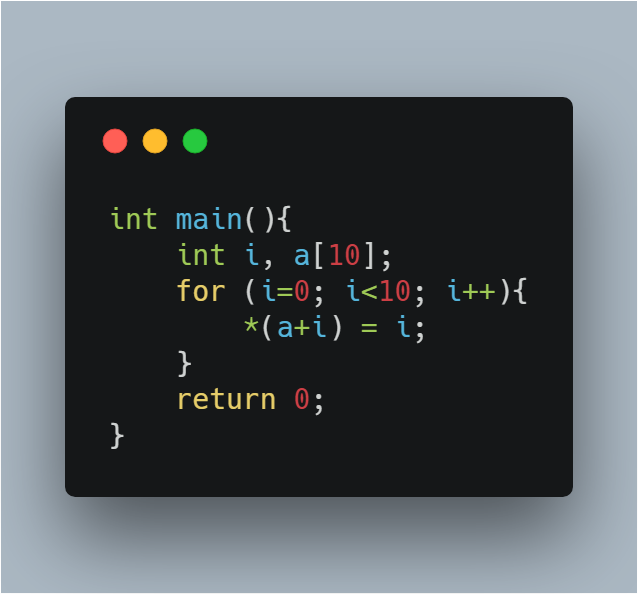
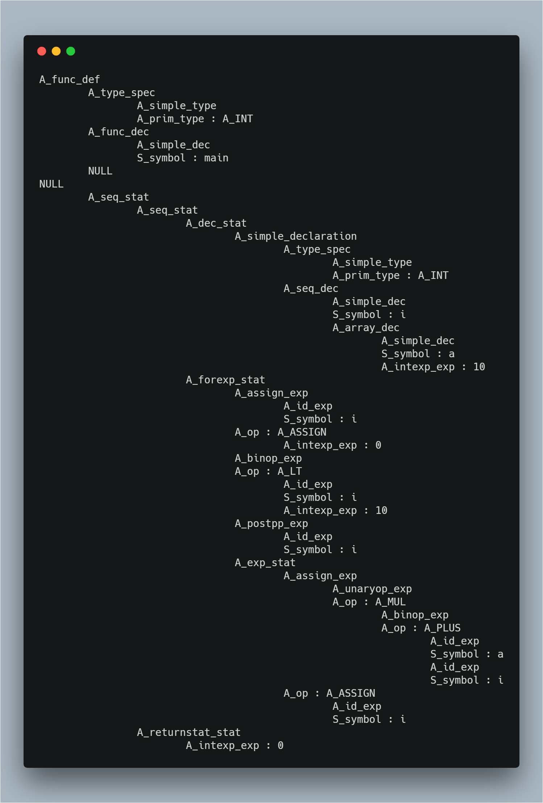

## <div align="center">编译系统设计实验</div>

### <div align="right">3150102103 肖  潼</div>

### <div align="right">3150104532 周佳瑜</div>

### <div align="right">3150104790 李天幼</div>

### <div align="center">设计目的</div>

设计并实现一个类C语言的编译系统，掌握编译原理的各个环节：词法分析、语法分析、语义分析、代码生成，以及实现所需的数据结构：语法书、符号表等。

### <div align="center">系统目标</div>

类C语言编译系统将会实现以下功能：

* 根据C语言标准文件 `Anti.C.Standard.pdf`，基本实现C语言所有的词法分析

* 根据C语言标准文件 `Anti.C.Standard.pdf`，基本实现C语言所有的语法分析

* 实现部分C语言的语义分析，生成中间树结构

* 分析生成的中间树，根据MIPS标准文件 `MIPS_Vol2.pdf`，生成MIPS汇编代码

### <div align="center">过程分析</div>

我们将整个类C语言编译系统分为以下几个步骤：

* lex词法分析

* yacc语法分析、生成抽象语法树

* 语义分析、生成符号表、生成栈帧、生成中间树

* 中间树规范化

* 指令选择

* 活跃性分析以及寄存器分配

下面我们将根据整个编译系统的设计顺序，介绍系统中每个模块的实现以及功能。

#### lex词法分析

我们设计的类C语言词法分析严格按照C语言标准，参照了C语言标准文档 `Anti.C.Standard.pdf`。

根据标准文档的分类，C语言词法主要分为以下几类：

1. keyword
    
    关键字共有37个，包含了常用的关键字比如 *auto*，*const* 等，以及不常用的关键字比如 *volatile*，*_Complex* 等

2. identifier

    标识符是由字母或下划线开头，包含字母，下划线或数字的任意长度的字符串，它的正则表达式为： `[a-zA-Z_][a-zA-Z0-9_]*`

3. constant

    常量类包含了6种常量：

    * 十进制整数
    * 八进制整数
    * 十六进制整数
    * 十进制浮点数
    * 十六进制浮点数
    * 字符常量

4. string-literal

    为了设计方便，字符串与其他常量划分为不同类，他是以 `L` 开头，被双引号包围的字符串，其中开头的 `L` 可以省略。
    
    它的正则表达式为：`L?\"([^\"\\\n]|(\\[\'\"\?\\abfnrtv]))*\"`

5. punctuator

    符号类包含了所有的运算或标识符，包含了例如运算符 `+`、`%`，或逻辑运算符 `&&`，`!`等

6. others

    其他符号类包含了一些没有运算层面含义的符号，比如 `\n`，`\\`等用于换行或标识的符号，其中用于匹配非法字符的 `.`，即 *default*，也定义在该类中

在词法分析这一步，我们使用的工具是更为现代的 *flex* 工具。

#### yacc语法分析、生成抽象语法树

在语法分析这一步，我们的类C语言编译系统能够解析出所有C语言标准中的语法，我们严格按照C语言标准文档 `Anti.C.Standard.pdf`进行设计，但舍去了部分不常见的类型比如 *_Bool*。

整个语法分析过程中使用了80余个 *token*， 一共能够解析69个语法，每个语法有多种解析格式，整个yacc语法分析文件有440余行，能够解析C语言中所有语法，判断程序语法的正确性。

语法分析对应的代码是 *parser.y* ，我们使用的工具是更为现代的 *bison* 工具。

我们在语法分析的过程中生成抽象语法树。这一部分对应的代码是 *absync* 和 *symbol* 部分，这部分的主要功能是在解析C语言语法的同时，利用yacc的语法，自底向上的构建抽象语法树。抽象语法树是具体语法树经过逻辑抽象以后得到的接近代码本身的表达，方便了后续语义分析和中间树转化的进行。由于这部分代码逻辑上的重复度很高，我们使用了C语言中的宏，大大地减少了代码量。

我们实现了C语言标准中的几乎所有语法，我们按照C语言标准文档将抽象语法树中的节点分类，每一个类别对应一个树上的节点，每个节点中有一到多个指针，指向组成这个节点的子节点。

1. Exp

    包括Expression部分的所有具体语法。具体而言，Exp又可以分为常量，var，subscript，function call， 结构成员访问，二元运算等。

2. Spec

    包括变量定义时的基本类型以及修饰符部分，不包括指针部分以及变量名等部分。比如int, float, struct{...}, const, volatile等。

3. Type

    是Spec的一个组成部分，包括基本类型和结构类型，联合类型，枚举类型。

4. Pointer
    
    仅包括指针部分，包括指针定义时的 * 以及const等修饰符。是dec的组成部分。

5. Param

    函数声明时的参数列表，是函数类型声明时的一个组成部分。

6. Dec

    对应语法中的declator，变量定义时Pointer以后的部分，包括变量名，函数名，函数参数列表等。

7. Declaration

    一个完整的声明，一定包括变量名。包括spec和dec，在语义分析中需要根据spec和dec综合得到变量的类型。

8. Type_name

    用于类型转换时括号中填入的类型，与declaration略有不同，不包括变量名。

9. Designator

    用于初始化时指定结构体或数组的成员。比如 .name, [0]。

10. Init

    初始化时的初始值，既可以是简单的常量表达式，也可以是给数组，结构体初始化的复杂表达式。

11. Stat

    具体的语句，包括以分号结尾的expression，以及for，while，if等流程控制语句。

12. Def

    是整个抽象语法树的树根，包括文件中的函数定义和变量定义。

整个模块代码生成一棵AST树，并且经由测试模块 *testAST* 可以将生成的树状结构输出，例如C语言代码如下：



该代码会被转为如下的AST树结构



#### 语义分析以及生成符号表

该部分的主要功能是，通过解析上一步生成的AST树，进行语义分析，判断是否有语法上的错误，例如如下代码：

    ++ 10;

该代码在语法分析和生成抽象语法树的部分都不会出现错误，因为 10 是一个unary_expression，而运算符 `++` 在yacc文件中的定义如下：

    unary_expression:
        DOUBLE_PLUS unary_expression      {$$ = _A_prepp_exp(charPos, $2);}

这一步并不会导致语法错误，而在语义层面上，常量是右值，不能进行 `++` 运算，这需要在语义分析中进行分析。

同时，在分析语义的过程中，我们还需要创立符号表。在C语言标准中，涉及到了三种link方式，分别为external，internal和nolink；4个scope，分别为file，function，block，function prototype；4个namespace，分别为label，tag，member，others。我们为了尽可能与标准一致，设立了两个环境，分别为linkenv和nameenv，linkenv中包含3张表，分别表示external，internal，nolink，nameenv中包含4张表，分别表示label，tag，member，others。同时每张表使用多层hash表的结构，每一层hash表表示一个scope，并用指针指向表示外层scope的hash表。每一个hash表实现了变量名到enventry的绑定，enventry中包括了该变量的类型Ty_ty以及该变量的存储方式Tr_access。通过这样的数据结构，我们可以在做变量重定义检查时与C语言标准尽可能一致。

为了能检查类型的完整性和进行内存分配，每一个类型Ty_ty在tiger的基础上加入了specs（变量的修饰，比如const），size，align，complete（检查完整性），为了支持长度为变量的数组，我们的size为expty类型，通常情况下类型为IntConst，表示常数，在变量长度的数组情况下，可以为一个Tr_exp类型的表达式。

为了表达C语言中丰富的类型，我们对Ty_ty结构进行了详细的设计。如之前所说，Ty_ty在tiger的基础上加入了specs，size，align，complete来帮助进行类型检查和内存分配。Ty_ty类型中又分为basicTy，forwardTy，nameTy，arrayTy，structTy，pointerTy等。

basicTy包括了最基本的类型，以及出现在程序里的常量的类型。对于出现在程序中的常量比如123，其类型为预定义的一个basicTy类型，地址与预定义的那个一致。该预定义的类型被设计为Ty_CONST而且是Ty_RVAL，表示既不能被更改，也不能取地址。区分这些程序中的常量是为了在确定数组大小的时候判断是定长的数组还是可变长度的数组。而对于用户在程序中定义的int a，a同样也是一个basicTy，并指向预定义的那个表示int的basicTy，从而和程序中的常量进行区分。对于const int a，a是一个basicTy，且specs属性为Ty_CONST，并指向表示int的basicTy类型的预定义变量。

forwardTy用来支持链表定义时需要的struct递归定义。在遇到struct的定义时，首先会新建一个forwardTy，并将这个forwardTy设置为incomplete，添加到符号表中。之后在struct定义内部遇到指向自己的指针时，会在符号表中找到这个forwardTy，并将这个成员变量的type指向这个forwardTy。C语言标准要求在struct成员变量定义时检测类型的完整性，于是type指针会找到pointerTy，然后找到forwardTy，并在forwardTy处停止进一步的搜索，回退到pointerTy，将pointerTy的complete设置为1，从而完成了指向自己的指针的定义。当struct定义完成后，forwardTy将被设置为complete，并指向刚刚定义完成的这个struct类型。

nameTy用来支持typedef的定义，对每一个typedef，都会创建一个nameTy类型指向具体绑定的类型，再将重新define的名字与这个nameTy类型进行绑定。而不是直接将define的名字与对应的类型绑定，因为这样会误解，以为这个名字是一个变量（C语言中typedef的名字和变量在同一个命名空间）。

对类型size，complete，align的分析采用递归的方式。对于一个复杂类型，确定size，complete，align要依赖于子类型，对于complete为1的子类型，直接获得它的size和align，不然需要递归分析这个子类型。对每一个分析完毕的类型，需要将complete设置为1，size和align设置为对应的expty和数值。

这一部分的代码在模块 *semant*， *table* ，*types* , *env* 中。

#### 翻译为中间树以及处理

抽象语法树虽然易于从代码中翻译出来，但是并不能够直接翻译成最终的汇编代码，我们需要将AST翻译为更加通用的中间代码树。

从这一过程开始，编译系统已经有了十分成熟的工具，C++语言库 *llvm*，该工具能够帮助编译器开发者自动生成中间代码树，并接手中间代码树之后的所有工作，直到生成可执行程序。

AST是C语言代码的树结构抽象，而IR树则更接近于整个代码的实际运算，它包含 `T_stm` 和 `T_exp` 两种类型的节点。

其中，`T_stm`类型节点保存着代码的执行状态信息，比如 `SEQ`，`JUMP`，`LABEL`等信息。而`T_exp`类型节点则保存的是运算类型的信息，比如`BINOP`，`CONST`，`ESEQ`。这两类节点组成的IR树，能够准确表达任何程序所做的工作，并且更接近底层的汇编代码。

在翻译为中间树后，我们还需要将IR树进一步处理，转化Canon树表示。Canon树以IR树为基础改进的数据结构，它是一个由链表串联起来的森林，森林中的每棵树的 `LABEL` 都放置在树的前序遍历最小的节点上，并且跳转语句代表的节点都放置在树的前序遍历最大的节点上。IR树种的`ESEQ`被`SEQ`完全取代，而`SEQ`所代表的顺序关系，又被Canon树中的链表所表示。

该部分代码在模块 *tree* （tiger提供）。

##### 规范树canon模块
1、	规范树canon模块（tiger提供）

规范树模块实现3个接口：

（1）	T_stmList C_linearize(T_stm stm)

调用linear()接口实现功能。

如果T_stm的顶层节点是T_SEQ，则递归调用linear()函数，将SEQ的左节点和右节点合并成一个stmList，其中右侧节点是递归调用的结果。

通过这个函数，将上一步生成的IR_tree拆解成简单的statements的列表。此列表不包含任何其他的优化，只是将seq和eseq拆开成线性的stm流程，和其他stm组合在一起。

（2）	Struct C_block C_basicBlocks(T_stmList stmList)

建立一个C_block结构体，此结构体包括一个label和一个stmListList，stmListList的最后一个树节点一定是jump或者cjump。调用mkBlocks()接口实现功能。

首先检测stmList的头结点（即第一个stm）是否是T_LABEL，因为基本块的要求是第一个节点必须是label，所以如果此label不存在，那么要建立一个新label（使用temp模块的Temp_newlabel()接口）。然后递归调用mkBlocks()函数继续执行。如果第一个stm是T_LABEL，那么返回一个stmListList，这个stmListList包括当前使用的stmList，加上以jump或cjump结尾的一个stmList，调用next()接口来找到这样一个stmList。

Static C_stmListList Next(T_stmList prevstms, T_stmList stms, Temp_label done)实现上述功能。如果stms不存在，说明基本块的末尾不是一个跳转指令，那么增加一个T_Jump跳转到done标号，以此基本块的结尾。如果stms存在，并且确实是T_JUMP或T_CJUMP，说明符合标准，下面以stms->tail作为头结点，调用mkBlocks()函数开始下一个基本块的流程，并返回下一基本块。如果stms是一个LABEL，则说明末尾没有jump和cjump，和刚才的情形一样，添加一个跳转到done标号的jump就可以了。如果上述情形都没发生，则说明基本块还没到末尾，继续递归调用next()，直到遇到基本块的末尾。

通过这个函数，我们把linearize出来的stm列表分成一个个block基本块，并形成一个stmListList，里面的每一个stmList都是一个基本块。基本块是最小的操作单元，基本块内部的指令必须全部执行完，不能跳转到另一个地方。下面对block的排序问题做优化。

（3）	T_stmList C_traceSchedule(struct C_block b)

此模块用于把每一个cjump后面的基本块都调整成false标号对应的基本块。建立一个block环境，此环境类似于其他环境，记录了每一个block的出现。使用for循环，把上一步生成C_block的第一个stmListList加入块环境中。最后调用getNext()接口完成功能。

Static T_stmList getNext()首先检测global_block（即前一步生成的block，这里做了重命名）的stmLists是否为空，若为空说明没有指令，那么返回一个T_LABEL结束。一般情况都不会为空。在不为空的情况下，从stmList列表中选择第一个stmList，检查在块环境中是否存在这个块，一般是存在的，如果不存在，就把这个块从block里删掉，从下一个stmList开始再调用getNext()。选择这个stmList之后，调用trace(s)接口开始对其进行分析。

Static void trace(T_stmList list)对刚才找到的stmList进行分析。调用getLast()接口找到stmList中的倒数第二个stm，命名为last；stmList中的第一个stm命名为lab（即label，第一个stm一定是label）；最后一个stm命名为s。

第一种情况，s是T_JUMP，这时检测它jump到的目标位置在块环境中是否存在，如果它存在，并且还有后续的stm，就把这两个块合并到一起，因为这个jump没有实际的意义，对后面这个stm也调用trace()继续这个合并过程。在不能合并的情况下，调用getNext()找到下一个块环境中的块，把s的tail指针指向它，这样就做了一次两个block之间的连接过程。

第二种情况，s是T_CJUMP，从块环境中找到true对应的stmList，命名为true；找到false对应的stmList，命名为false。如果false不为空，就把s的tail连接到false。如果false为空，就把true的标号改成false，然后连接到s的tail。如果它们两个都是null，就建立一个名叫false的label，把它连接到cjump的false标号，这个false的实际内容用getNext()从块环境中找一个有用的块填充。如果s既不是jump也不是cjump，就assert(0)，这种情况不应该发生，程序停止。

（4）	其他接口

Static T_stm reorder(T_expList rlist)对T_exp进行reorder排序。这个接口的主要目的是拆解T_exp为stmExp集合，并且如果可以交换的话，把s与e进行交换，先执行s再执行e，然后去掉所有call，换成ESEQ。
首先检测expList的head是否是call，如果是的话，把call换成T_Eseq(T_Move(T_Temp(t), *rlist->head), T_Temp(t))，然后继续进行。对于顶层的head不是call的情况，对head做do_exp()函数得到hd，然后对其tail继续reorder()。一系列操作做完之后，检查s和hd.e是否可交换，利用的是commute()函数，如果可交换，就将head设置为hd.e，然后返回一个seq(hd.s, s)。如果不可交换，就把hd.e放入一个临时变量t，再返回seq，即seq(hd.s, seq(T_Move(T_Temp(t), hd.e), s))。

Static struct stmExp(T_exp exp)对exp进行分析。如果是binop，则把左右操作数分开，对他们调用reorder进行排序，然后结合它自己这个exp，返回stmExp。如果是mem，就把mem和null合成一个expList，进行reorder()，然后结合它自己这个exp，返回stmExp。如果是eseq，对它的exp做do_exp，对它的stm做do_stm，然后把stm和x.s合成一个seq，在与x.e合成一个stmExp返回。如果是call，使用get_call_rlist()函数得到它的参数形成的expList，对其做reorder，再结合它自己，返回一个stmExp。

Static T_stm do_stm(T_stm stm)用于把所有的stm都拆解成顶层的seq和嵌套的底层seq，以便于后面形成stmList。对于T_SEQ，把左右stm合成一个seq。对于T_JUMP，使用reorder对exp进行排序，再与它自己合成一个seq。对于CJUMP，和JUMP类似。对于MOVE，根据源地址和目的地址的不同，分别处理。对于call类型的EXP，也做这种处理。


#### 活跃性分析以及寄存器分配

在IR树和Canon树中，我们默认CPU中有无限多的寄存器，这样我们可以申请任意多的临时寄存器，来存储我们的变量。然而，在实际情况中，寄存器的数量都是有限的，可以提供给运行程序的寄存器更加稀缺，当我们需要使用一个变量的时候，要么它在寄存器中，要么我们需要从内存中将该变量读取到寄存器中，这个操作消耗更多的时间。

活跃性分析就是分析变量在代码的哪些位置是活跃的，也就是需要被使用的。分析出这些信息后，我们可以构建临时变量的冲突图，并在冲突图上运行图染色算法，从而获得较优，甚至最优的寄存器分配方案，这个方案能够让我们的程序在运行时，花费较少的时间在无意义的数据IO操作上。

该部分的代码在模块 *temp* （tiger提供）和 *map* 中。

染色算法使用的是书中介绍的贪心的染色方法，分为下面五个步骤：

* 构造 ： 获得活跃性分析中的信息，构造出临时变量的冲突图

* 简化 ： 将冲突图中的一定能够染色的点去除，简化整张冲突图。即将冲突图中的，节点度数小于k的节点删除，因为这些节点一定能够被染色。

* 溢出 ： 溢出操作将整张图的节点一个一个地删除，将最不可能被染色地点首先删除，即那些节点度数最高地点删除并放入栈中。

* 选择 ： 我们从栈中逐个弹出节点，并将该节点染成适合地颜色，如果该节点无法被染色，那么说明这张图染色失败

* 重新开始 ： 我们找到染色失败地节点，在代码中将该节点对应地临时变量放入内存中，并且重复以上步骤，知道染色成功

整个算法中的染色分配部分，由模块 *map* 实现，整个算法被包装为一个函数```void mapped(int** a, int n, int k, int* res)```。

其中参数`a`是储存着冲突图邻接表的数组，`n`是冲突图中节点的个数，`k`是需要颜色的数量，对于几乎所有的体系结构来说，寄存器的数量不会超过32，所以我们默认k的最大值为32，`res`数组存储着染色的结果，对于染色失败的节点，它的颜色将会是-1。


#### 指令选择以及翻译

这是部分是整个编译系统中最后一个部分，我们在得到了接近汇编代码的Canon树和寄存器分配方案后，通过对Canon树进行解析，从而获得最后的MIPS汇编代码。

然而，Canon树的解析方案可能有很多种，我们可以使用动态规划算法，得到需要指令数最少的翻译方案，从而获得高效的MIPS汇编代码。

该部分的代码在模块 *assem* 中(tiger提供)。

Assem.h定义了指令需要的数据结构。AS_instr表示一个指令，包括一个kind，一个OPER，一个LABEL，一个MOVE。

（1）	AS_proc AS_Proc(string p, AS_instrList b, string e)接口
建立一个AS_proc对象，prolog, epilog使用参数中的对应字符串，proc->body使用参数中的AS_instrList对象。返回这个对象。

（2）	AS_targets AS_Targets(Temp_labelList labels)接口
这个函数返回一个labelList，建立一个AS_targets对象，然后将p->labels设置成参数中的labelList，再返回。

（3）	AS_instr AS_Oper(string a, Temp_tempList d, Temp_tempList s, AS_targets j)接口
建立一个AS_instr对象p，kind=I_OPER，将OPER结构体中的assem=a, dst=d, src=s, jumps=j，设置好后返回这个AS_instr对象。

（4）	AS_instr AS_Label(string a, Temp_label label)
建立一个AS_instr对象p，kind=I_LABEL，将OPER结构体中的assem=a, label=label，设置好后返回这个AS_instr对象。

（5）	AS_instr AS_Move(string a, Temp_tempList d, Temp_tempList s)
建立一个AS_instr对象p，kind=I_MOVE，将OPER结构体中的assem=a, dst=d, src=s，设置好后返回这个AS_instr对象。

（6）	AS_instrList AS_splice(AS_instrList a, AS_instrList b)接口
这个函数只是把a和b连接在一起，然后返回。建立一个AS_instrList对象p，把b对象放在a对象的末尾，集合成p，然后返回p；

（7）	Static void format(char* result, string assem, Temp_tempList dst, Temp_tempList src, AS_targets jumps, Temp_map m)接口
这个函数把result对应的字符串，按照参数中的dst，src，jumps，m，写入相应的内容。每一个’`’对应一个对象，例如”`s”对应src源操作数，用nthTemp()接口查找这个字符串，然后写到result里。类似的还有”`d”, “`j”，遇到连续两个’`’结束分析。

（8）	Static Temp_temp nthTemp(Temp_tempList list, int i)
这个函数从tempList临时变量列表里，按照i的顺序读取一个临时变量。通过递归的方法实现，nthTemp(list->tail, i-1)。

（9）	Static Temp_label nthLabel(Temp_labelList list, int i)
与上一个函数类似，这个函数寻找一个label，从给定的labelList里。

（10）	Void AS_printInstrList(FILE *out, AS_instrList iList, Temp_map m)
这个函数打印一个instrList，通过调用AS_print()函数实现。

（11）	Void AS_print(FILE *out, AS_instr I, Temp_map m)
这个函数是打印instruction的函数，建立一个char类型数组r，代表result，然后通过参数里的instr的类型，调用format()函数打印对应的指令，然后输出到文件里。


### 测试代码

整个 *CCompiler* 工程包含近万行代码，是一个非常大地工程，各个部分代码关系紧密，分工明确。如果在所有人的代码都完成后，同意连接起来进行测试，会让整个程序的测试过程变得复杂无比，甚至难以完成测试。因此我们需要定义多个里程碑点，在里程碑点的部分进行系统的局部测试，保证代码到当前位置能够正确地运行。

我们设置了两个大的里程碑点，即：

* AST测试点

* IR树测试点

这两个节点对应了整个编译系统中最关键的两个步骤：抽象语法树的构建和中间树的构建。

对于AST测试点，我们的测试方法是将整颗抽象语法树输出到屏幕上，用到的模块是 *testAST*。

在 *testAST* 模块中，我们对AST中的每个种类的节点都定义了一个对应的测试函数，具体如下：

``` c
void TA_symbol(S_symbol in);
void TA_exp(A_exp in);
void TA_spec(A_spec in);
void TA_type(A_type in);
void TA_pointer(A_pointer in);
void TA_param(A_param in);
void TA_dec(A_dec in);
void TA_declaration(A_declaration in);
void TA_type_name(A_type_name in);
void TA_designator(A_designator in);
void TA_init(A_init in);
void TA_stat(A_stat in);
void TA_def(A_def in);
void TA_op(A_op in);
void TA_storage_type(A_storage_type in);
void TA_prim_type(A_prim_type in);
void TA_qual_type(A_qual_type in);
void TA_func_type(A_func_type in);
```

在测试的时候，我们将整棵AST传入到对应的节点，测试程序将会自己解析该节点，并递归输出子树，这样整颗AST就被打印到屏幕上。

对于IR树，因为该数据结构是连接汇编语言层和高级语言层的纽带，因此我们的CCompiler中的IR树和书中的Tiger编译器中的IR树大同小异，我们则直接采用了书中的测试代码。

该代码定义了`void printStmList (FILE *out, T_stmList stmList);`，该函数将IR树的数据结构打印到输出流`out`中。

### <div align="center">总结</div>

在这次编译原理课程实验中，我们小组实现了一个类C语言的编译系统。

在词法分析和语法分析到AST的生成，我们按照C语言标准文档，`Anti.C.Standard.pdf`，完全实现了C语言的所有语法。

在语义分析中，由于C语言标准文档太长，尽可能实现了看到的规定，但还有很多没有看到的要求。

转换为中间树的代码还在更新中，目前已经写好了函数接口。

在系统的后半部分，从IR树到生成MIPS汇编代码的部分，也就是后端部分，我们选择了C语言的一些基本功能并加以实现，最终按照MIPS架构标准文档，生成了MIPS汇编代码。

整个项目挂载于开源项目网站Github上，项目名称为 [CCompiler](https://github.com/greyring/CCompiler)。

